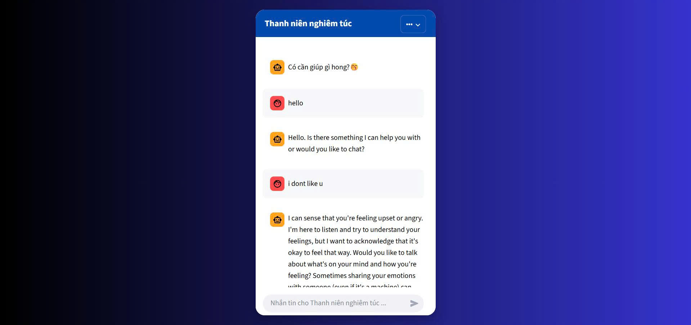

# 🤖 Chatbot – Loading – Powered by Ollama LLM

> Đồ án môn học **Nhập môn Công nghệ Thông tin** > **Khoa Công nghệ Thông tin > Trường Đại học Khoa học Tự nhiên, ĐHQG-HCM**
Dự án này xây dựng một Chatbot AI có giao diện trực quan, hỗ trợ đa cuộc hội thoại, lưu trữ lịch sử và kết nối với mô hình ngôn ngữ lớn thông qua Ollama Server.
---
## 🤖 Giao diện (UI)

# How to run 
1) Upload the file 2A_ollama_pinggy_ngrok.ipynb to Google Colab and run cells. (change !ollama pull gpt-oss:20b  -->   !ollama pull llama3.2:1b)
2) Create a Colab Secret with: (Name: NGROK_API_KEY / Value: your Ngrok API key.) 
3) After the notebook finishes running, locate the line: * ngrok tunnel https://......ngrok-free.dev -> http://127.0.0.1:11434
4) Copy the Ngrok URL (e.g. https://......ngrok-free.dev) and assign it to NGROK_URL = "...."
5) Run the application code to start the chatbot.

# Chatbot AI

